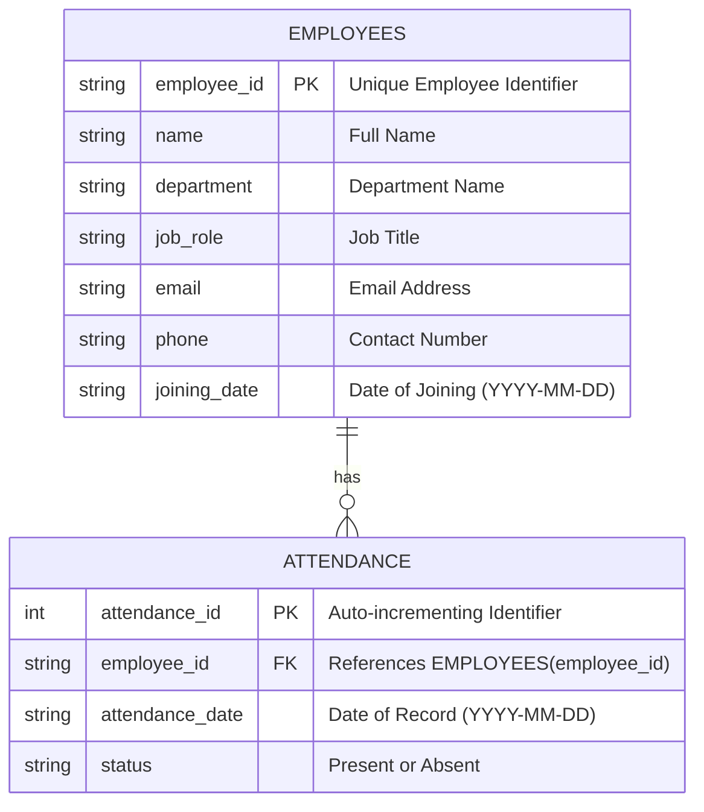
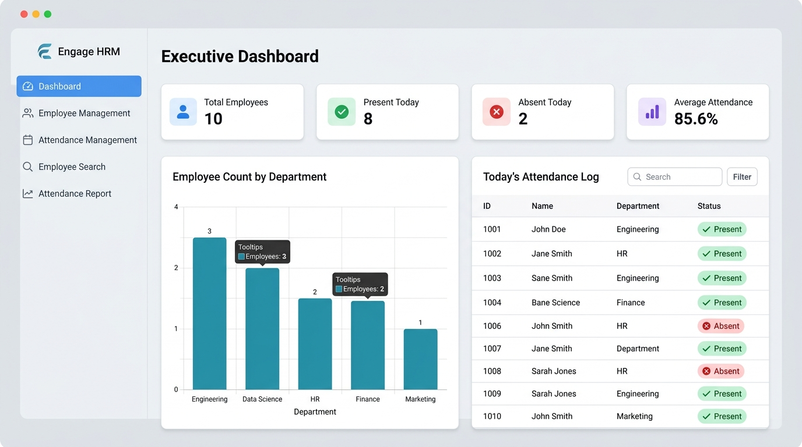
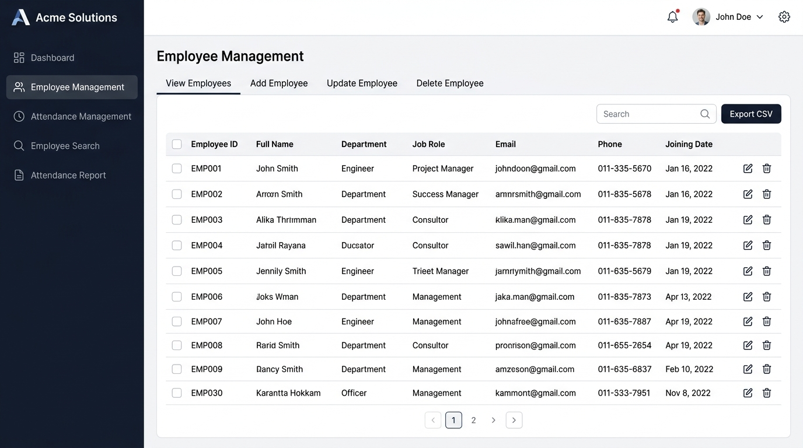
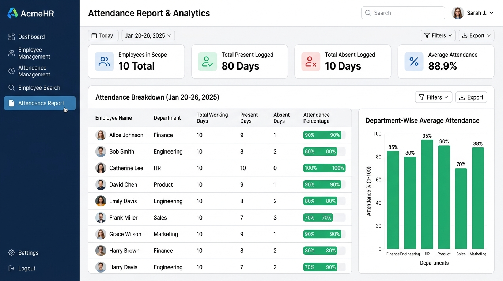

# 🏢 Employee Management & Attendance System

A lightweight, production-style web application built with **Python**, **Streamlit**, **SQLite**, and **Pandas** to streamline employee records and daily attendance tracking. Designed specifically as a clean, modular portfolio project for entry-to-intermediate Data Science and Cloud Data Engineering interviews (e.g., HCLTech / Berribot).

---

## 📌 Table of Contents
- [Overview](#-overview)
- [Problem Statement](#-problem-statement)
- [Objectives](#-objectives)
- [Key Features](#-key-features)
- [Technology Stack](#-technology-stack)
- [Database Design & Schema](#-database-design--schema)
- [Application Workflow](#-application-workflow)
- [Project Structure](#-project-structure)
- [Installation & Setup](#-installation--setup)
- [How to Run the Application](#-how-to-run-the-application)
- [Screenshots](#-screenshots)
- [Future Improvements](#-future-improvements)

---

## 📖 Overview

Organizations require a dependable and transparent system to register employee profiles, record attendance, and compute workforce participation metrics. The **Employee Management & Attendance System** provides an intuitive, web-based graphical interface powered by Streamlit and backed by a local SQLite relational database. It enables HR and team managers to perform full CRUD operations on employee data, record daily attendance, search records dynamically, and generate attendance analytics using Pandas.

---

## 🚨 Problem Statement

Manual attendance tracking and spreadsheet-based employee logs often suffer from:
1. **Data Inconsistency:** Duplicate IDs, missing fields, and accidental overwrites.
2. **Lack of Relational Integrity:** Attendance logs without strict links to valid employee records.
3. **Complex Reporting:** Calculating individual attendance percentages and department-wide metrics across hundreds of rows manually in spreadsheets is tedious and error-prone.
4. **Poor Usability:** Clunky user interfaces make daily roster marking cumbersome.

---

## 🎯 Objectives

- **Relational Data Modeling:** Establish a clean 1-to-many relationship between employees and attendance with Primary/Foreign key constraints.
- **Full CRUD Capabilities:** Allow seamless creation, reading, updating, and deletion of employee records.
- **Accurate Analytics:** Automate attendance percentage calculations and department aggregations using Pandas.
- **Beginner-Friendly Architecture:** Maintain clean separation of concerns across database (`database.py`), employee interface (`employee.py`), and attendance reporting (`attendance.py`) without unnecessary framework bloat.

---

## ✨ Key Features

### 1. 👥 Employee Management
- **Add Employee:** Form validation for Employee ID, Name, Department, Job Role, Email, Phone, and Joining Date.
- **View Employees:** Interactive tabular display with dynamic sorting, filtering, and one-click CSV export.
- **Update Employee:** Pre-populated forms to quickly update job role, contact details, or department.
- **Delete Employee:** Safe deletion with confirmation modal and automatic cascade removal of orphan attendance records.

### 2. 📅 Attendance Management
- **Single Attendance Marking:** Select any employee, pick a date, and record status (`Present` or `Absent`).
- **Quick Daily Sheet (Batch Mode):** View the entire employee roster for any selected date and mark attendance simultaneously.
- **Attendance History & Logs:** View historical logs with date range filters and employee dropdowns.
- **Conflict Handling:** Automatically updates existing records if attendance for an employee is marked multiple times on the same date.

### 3. 🔍 Employee Search
- Search through records by **Employee ID**, **Name**, or **Department** using SQL `LIKE` queries.
- Detailed card view showing employee profile alongside their individual attendance history.

### 4. 📈 Attendance Report & Analytics
- Automated computation of:
  - Total Working Days
  - Present Days
  - Absent Days
  - Attendance Percentage: $$\text{Attendance \%} = \left(\frac{\text{Present Days}}{\text{Total Working Days}}\right) \times 100$$
- Visual progress bars for attendance compliance.
- Department-wise attendance comparison charts powered by Pandas `groupby`.
- One-click CSV export of the finalized attendance report.

### 5. 📊 Executive Dashboard
- Real-time KPI summary cards:
  - **Total Employees**
  - **Present Today**
  - **Absent Today**
  - **Average Attendance Rate (%)**
- Department distribution bar chart.
- Today's live attendance snapshot table.

---

## 🛠️ Technology Stack

| Component | Technology | Rationale |
|---|---|---|
| **Programming Language** | Python 3.10+ | Industry-standard language for data engineering, readable and modular. |
| **User Interface** | Streamlit | Rapid, interactive web application framework for data tools. |
| **Database** | SQLite 3 | Serverless, zero-configuration relational database included in Python's standard library. |
| **Query Language** | SQL | Standard SQL queries (`SELECT`, `INSERT`, `UPDATE`, `DELETE`, `JOIN`, `COUNT`). |
| **Data Processing** | Pandas | High-performance data manipulation, aggregations, and report generation. |

---

## 🗄️ Database Design & Schema

The application uses an SQLite database located at `database/employee_management.db`.



### 1. `employees` Table
```sql
CREATE TABLE IF NOT EXISTS employees (
    employee_id TEXT PRIMARY KEY,
    name TEXT NOT NULL,
    department TEXT NOT NULL,
    job_role TEXT NOT NULL,
    email TEXT NOT NULL,
    phone TEXT NOT NULL,
    joining_date TEXT NOT NULL
);
```

### 2. `attendance` Table
```sql
CREATE TABLE IF NOT EXISTS attendance (
    attendance_id INTEGER PRIMARY KEY AUTOINCREMENT,
    employee_id TEXT NOT NULL,
    attendance_date TEXT NOT NULL,
    status TEXT NOT NULL CHECK(status IN ('Present', 'Absent')),
    FOREIGN KEY (employee_id) REFERENCES employees (employee_id) ON DELETE CASCADE,
    UNIQUE (employee_id, attendance_date)
);
```

### Key Relational Constraints:
- **Primary Key (`PK`):** `employees.employee_id` uniquely identifies each employee.
- **Foreign Key (`FK`):** `attendance.employee_id` enforces referential integrity, ensuring attendance records only exist for valid employees.
- **`ON DELETE CASCADE`:** When an employee is removed, all their historical attendance logs are automatically purged to prevent orphaned records.
- **`UNIQUE(employee_id, attendance_date)`:** Prevents duplicate contradictory records for an employee on the same date.

---

## 🔄 Application Workflow

```text
[ User / HR Manager ]
         │
         ▼
[ Streamlit Web UI (app.py) ]
    ├── Sidebar Navigation
    ├── Executive Dashboard
    ├── Employee Management (employee.py)
    └── Attendance & Reporting (attendance.py)
         │
         ▼
[ Database Layer (database.py) ]
    ├── Parameterized SQL Queries (INSERT, SELECT, UPDATE, DELETE, JOIN)
    └── SQLite Connection & Transaction Management
         │
         ▼
[ SQLite Engine (database/employee_management.db) ]
    ├── employees table
    └── attendance table
```

---

## 📁 Project Structure

```text
Employee-Management-Attendance-System/
│
├── app.py                     # Main Streamlit application and executive dashboard
├── database.py                # Database connection, tables, and SQL CRUD functions
├── employee.py                # Streamlit UI logic for Employee CRUD & Search
├── attendance.py              # Streamlit UI logic for Attendance Tracking & Reports
├── requirements.txt           # Python dependency specifications
├── README.md                  # Comprehensive project documentation
├── INTERVIEW_PREP.md          # 20 HCLTech interview Q&A + core technical explanations
│
├── database/
│   └── employee_management.db # SQLite relational database file
│
├── sample_data/
│   └── employees.csv          # Starter dataset containing realistic employee records
│
└── screenshots/
    ├── dashboard.png          # Screenshot of Executive Dashboard
    ├── employee_management.png# Screenshot of Employee Management Interface
    └── attendance_report.png  # Screenshot of Attendance Report & Analytics
```

---

## ⚙️ Installation & Setup

### Prerequisites
- Python 3.9, 3.10, 3.11, or 3.12 installed on your system.
- Git installed.

### 1. Clone the Repository
```bash
git clone https://github.com/Jeelanimohammad/project2.git
cd project2
```

### 2. Create a Virtual Environment (Optional but Recommended)
```bash
# On Windows
python -m venv venv
venv\Scripts\activate

# On macOS/Linux
python3 -m venv venv
source venv/bin/activate
```

### 3. Install Dependencies
```bash
pip install -r requirements.txt
```

---

## 🚀 How to Run the Application

Start the Streamlit application using the command:

```bash
streamlit run app.py
```

Once started, the application will automatically open in your default browser at:
```text
http://localhost:8501
```

> **Note:** The application automatically initializes the SQLite tables and pre-seeds 10 sample employees with 10 days of attendance on first launch. You can reset or reload sample data at any time via the sidebar button **"🔄 Reload Sample Data"**.

---

## 📸 Screenshots

### 1. Executive Dashboard


### 2. Employee Management (View, Add, Update, Delete)


### 3. Attendance Report & Analytics


---

## 🔮 Future Improvements

1. **Role-Based Access Control (RBAC):** Add secure authentication separating Admin (HR) and Employee views.
2. **Cloud Database Migration:** Migrate SQLite to PostgreSQL or Snowflake on AWS/Azure for distributed enterprise scale.
3. **Automated ETL Pipeline:** Build an Apache Airflow or AWS Glue pipeline to extract attendance logs, compute rolling 30-day KPIs, and load them into a Cloud Data Warehouse.
4. **Leave & Holiday Management:** Add support for paid leaves, sick leaves, and public holiday calendars.
5. **Automated Alerts:** Send automated email or Slack notifications for employees falling below 75% attendance threshold.

---

## 👨‍💻 Author & Acknowledgements
- **Author:** Mohammed Jeelani
- **Target Role:** Cloud Data Engineer (HCLTech / Berribot)
- Built with Python, Streamlit, SQLite, and Pandas.